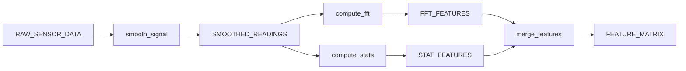

# Discovery Agent Enhancement Plan: Rich Metadata & Modular Wiki Structure

## Status: ✅ APPROVED - READY FOR IMPLEMENTATION

Enhance Discovery Agent to capture comprehensive Dataiku metadata and generate scannable, modular Wiki documentation (CLAUDE.md-style) that enables Executor Agents to understand and work with discovered blocks effectively.

---

## Executive Summary

**Problem**: Current Discovery Agent writes minimal metadata to Wiki - just basic block info (inputs/outputs/contains). Not enough detail for an Executor Agent to understand what's available or how to use discovered blocks.

**User's Vision**: "Think about it as if you had your own Claude.md file for the project. You would not want to place everything into the Claude. You want it easily scannable."

**Solution**: Enhance Discovery Agent to:
1. **Capture rich metadata** from Dataiku API (datasets, recipes, libraries, notebooks, tags, descriptions)
2. **Generate modular Wiki structure** with quick navigation (CLAUDE.md-style)
3. **Provide moderate detail** - enough for Executor to explore, not overwhelming
4. **Use pointers** where appropriate (Executor can deep-dive later if needed)

---

## Current State Analysis

### What We Currently Capture (BlockMetadata)

**Basic Identifiers:**
- block_id, version, type, source_project, source_zone
- name, description, hierarchy_level, domain, tags

**Structure:**
- inputs: List[BlockPort] - name, type, required, description
- outputs: List[BlockPort] - name, type, required, description
- contains: BlockContents - datasets[], recipes[], models[]

**Metadata:**
- created_at, updated_at, created_by
- dependencies{}, bundle_ref

### What We Currently Write to Wiki

```markdown
---
block_id: FEATURE_ENGINEERING
version: 1.0.0
type: zone
---

# Feature Engineering Block

## Description
[Basic description]

## Inputs
| Name | Type | Required | Description |
|------|------|----------|-------------|
| RAW_DATA | dataset | Yes | |

## Outputs
| Name | Type | Description |
|------|------|-------------|
| FEATURES | dataset | |

## Contains
**Datasets:** intermediate_1, intermediate_2
**Recipes:** compute_features

## Usage
[YAML example]
```

### Critical Gaps

**Missing Metadata:**
- ❌ Dataset details (connection, format, schema columns, partitioning)
- ❌ Recipe details (type, engine, configuration, code snippets)
- ❌ Flow graph / lineage visualization
- ❌ Project libraries (code packages used)
- ❌ Notebooks (analysis/documentation)
- ❌ Tags and rich descriptions for all elements
- ❌ Performance hints (dataset sizes, build times)

**Missing Structure:**
- ❌ No quick navigation at top (like CLAUDE.md)
- ❌ Everything in one flat article
- ❌ No way to scan without reading everything
- ❌ No links to detailed component info

---

## Enhanced Solution Design

### 1. Data Model Enhancement

**Extend BlockMetadata with:**

```python
@dataclass
class DatasetDetail:
    """Rich dataset metadata for documentation."""
    name: str
    type: str  # "Snowflake", "S3", "PostgreSQL", etc.
    connection: str
    format_type: str  # "parquet", "csv", etc.
    schema_summary: Dict  # {column_count: 50, sample_cols: ["ID", "NAME", ...]}
    partitioning: Optional[str]
    tags: List[str]
    description: str
    estimated_size: Optional[str]  # "1.2GB", "unknown"
    last_built: Optional[str]

@dataclass
class RecipeDetail:
    """Rich recipe metadata for documentation."""
    name: str
    type: str  # "python", "sql", "sync", etc.
    engine: str  # "DSS", "Spark", "Snowflake", etc.
    inputs: List[str]  # Dataset names
    outputs: List[str]  # Dataset names
    description: str
    tags: List[str]
    code_snippet: Optional[str]  # First 10 lines for context
    config_summary: Dict  # Key config params

@dataclass
class LibraryReference:
    """Project library reference."""
    name: str
    type: str  # "python", "R"
    description: str

@dataclass
class NotebookReference:
    """Project notebook reference."""
    name: str
    type: str  # "jupyter", "SQL"
    description: str
    tags: List[str]

@dataclass
class EnhancedBlockMetadata(BlockMetadata):
    """Extended metadata with rich component details."""
    # Component details
    dataset_details: List[DatasetDetail] = field(default_factory=list)
    recipe_details: List[RecipeDetail] = field(default_factory=list)
    library_refs: List[LibraryReference] = field(default_factory=list)
    notebook_refs: List[NotebookReference] = field(default_factory=list)

    # Flow graph data
    flow_graph: Optional[Dict] = None  # Simplified graph for visualization

    # Usage metadata
    estimated_complexity: str = ""  # "simple", "moderate", "complex"
    estimated_size: str = ""  # Total data volume estimate
```

### 2. Wiki Article Structure (CLAUDE.md-Style)

**Main Block Article:** `_DISCOVERED_BLOCKS/{BLOCK_ID}.md`

```markdown
---
block_id: FEATURE_ENGINEERING
version: 1.0.0
type: zone
---

# Feature Engineering Block

> **Quick Summary**: Transforms raw sensor data into ML-ready features
> **Complexity**: Moderate | **Data Volume**: ~2.5GB | **Recipes**: 5

## 🗺️ Quick Navigation

- [Overview](#overview)
- [Inputs & Outputs](#inputs--outputs)
- [Internal Components](#internal-components)
  - [Datasets (12)](#datasets)
  - [Recipes (5)](#recipes)
  - [Libraries](#project-libraries)
- [Flow Diagram](#flow-diagram)
- [Usage Guide](#usage-guide)
- [Technical Details](#technical-details)

---

## Overview

[Description]

**Domain**: sensor_analytics
**Hierarchy**: process
**Tags**: `feature-engineering`, `ml-prep`, `sensors`

---

## Inputs & Outputs

### Inputs

| Port | Dataset Type | Schema | Description |
|------|--------------|--------|-------------|
| RAW_SENSOR_DATA | Snowflake | [50 columns](#schema-raw_sensor_data) | Raw readings from IoT devices |

### Outputs

| Port | Dataset Type | Schema | Description |
|------|--------------|--------|-------------|
| FEATURE_MATRIX | Snowflake | [120 columns](#schema-feature_matrix) | Engineered features for ML |

---

## Internal Components

### Datasets

<details>
<summary><b>12 internal datasets</b> - Click to expand</summary>

#### Core Datasets

**`SMOOTHED_READINGS`** (Snowflake, partitioned by sensor_id)
- **Purpose**: Noise-reduced sensor readings
- **Schema**: 52 columns (see [schema file](schemas/FEATURE_ENGINEERING_SMOOTHED_READINGS.schema.json))
- **Size**: ~800MB
- **Tags**: `intermediate`, `time-series`

**`FFT_FEATURES`** (Snowflake)
- **Purpose**: Frequency domain features
- **Schema**: 45 columns (see [schema file](schemas/FEATURE_ENGINEERING_FFT_FEATURES.schema.json))
- **Size**: ~200MB
- **Tags**: `features`, `fft`

[... 10 more datasets ...]

</details>

### Recipes

<details>
<summary><b>5 recipes</b> - Click to expand</summary>

#### `smooth_signal` (Python/Pandas)
**Purpose**: Apply moving average smoothing
**Inputs**: RAW_SENSOR_DATA
**Outputs**: SMOOTHED_READINGS
**Logic Preview**:
```python
# Apply rolling window smoothing
df['smooth_value'] = df.groupby('sensor_id')['value'] \
    .rolling(window=10).mean()
```

#### `compute_fft` (Python/Numpy)
**Purpose**: Extract frequency domain features
**Inputs**: SMOOTHED_READINGS
**Outputs**: FFT_FEATURES
**Config**: fft_window=256, overlap=0.5

[... 3 more recipes ...]

</details>

### Project Libraries

- **`signal_processing`** (Python) - Custom DSP functions
- **`feature_utils`** (Python) - Feature engineering utilities

### Notebooks

- **`feature_exploration.ipynb`** - Feature analysis and validation

---

## Flow Diagram



---

## Usage Guide

### Quick Start

```yaml
blocks:
  - ref: "BLOCKS_REGISTRY/FEATURE_ENGINEERING@1.0.0"
    inputs:
      RAW_SENSOR_DATA: your_sensor_dataset
    outputs:
      FEATURE_MATRIX: your_feature_dataset
```

### Prerequisites

- **Connections**: Snowflake warehouse access
- **Libraries**: `signal_processing`, `feature_utils` (available in project)
- **Compute**: Recommended Spark for large datasets

---

## Technical Details

<details>
<summary><b>Schema Details</b> - Click to expand</summary>

### Schema: raw_sensor_data

| Column | Type | Description |
|--------|------|-------------|
| sensor_id | string | Sensor identifier |
| timestamp | datetime | Reading timestamp |
| value | double | Sensor reading |
[... 47 more columns ...]

[Full schema](schemas/FEATURE_ENGINEERING_RAW_SENSOR_DATA.schema.json)

### Schema: feature_matrix

| Column | Type | Description |
|--------|------|-------------|
| sensor_id | string | Sensor identifier |
| window_start | datetime | Feature window start |
| fft_peak_1 | double | Primary frequency peak |
[... 117 more columns ...]

[Full schema](schemas/FEATURE_ENGINEERING_FEATURE_MATRIX.schema.json)

</details>

---

## Changelog

- **1.0.0**: Initial release with 5 recipes, 12 internal datasets

```

### 3. Implementation Strategy

**Phase 1: Enhance Data Collection**

*File*: `dataikuapi/iac/workflows/discovery/identifier.py`

```python
def extract_block_metadata(self, project_key, zone_name, boundary):
    """
    Extract complete block metadata with rich component details.

    NEW: Calls _extract_dataset_details(), _extract_recipe_details(),
         _extract_library_refs(), _extract_notebook_refs()
    """
    # ... existing code ...

    # NEW: Extract rich component details
    dataset_details = self._extract_dataset_details(project, boundary['internal_datasets'])
    recipe_details = self._extract_recipe_details(project, boundary['internal_recipes'])
    library_refs = self._extract_library_refs(project)
    notebook_refs = self._extract_notebook_refs(project)

    return EnhancedBlockMetadata(
        # ... existing fields ...
        dataset_details=dataset_details,
        recipe_details=recipe_details,
        library_refs=library_refs,
        notebook_refs=notebook_refs,
        flow_graph=self._extract_flow_graph(boundary),
    )

def _extract_dataset_details(self, project, dataset_names) -> List[DatasetDetail]:
    """Extract rich metadata for each dataset using Dataiku API."""
    details = []
    for name in dataset_names:
        try:
            ds = project.get_dataset(name)
            settings = ds.get_settings()

            detail = DatasetDetail(
                name=name,
                type=settings.type,
                connection=settings.get_raw().get('params', {}).get('connection', ''),
                format_type=settings.get_raw().get('formatType', ''),
                schema_summary=self._summarize_schema(ds.get_schema()),
                tags=settings.get_raw().get('tags', []),
                description=settings.get_raw().get('description', ''),
                # ... more fields from API ...
            )
            details.append(detail)
        except Exception as e:
            # Log and skip dataset on error
            pass

    return details
```

**Phase 2: Enhance Wiki Generation**

*File*: `dataikuapi/iac/workflows/discovery/catalog_writer.py`

```python
def generate_wiki_article(self, metadata: EnhancedBlockMetadata) -> str:
    """
    Generate modular, scannable wiki article.

    NEW: Adds quick navigation, collapsible sections, rich component details
    """
    sections = []

    # 1. Frontmatter (existing)
    sections.append(self._generate_frontmatter(metadata))

    # 2. Quick Summary Box (NEW)
    sections.append(self._generate_quick_summary(metadata))

    # 3. Quick Navigation (NEW)
    sections.append(self._generate_navigation_menu(metadata))

    # 4. Overview (enhanced)
    sections.append(self._generate_overview_section(metadata))

    # 5. Inputs & Outputs (enhanced with schema links)
    sections.append(self._generate_io_section(metadata))

    # 6. Internal Components (NEW - detailed)
    sections.append(self._generate_components_section(metadata))

    # 7. Flow Diagram (NEW)
    if metadata.flow_graph:
        sections.append(self._generate_flow_diagram(metadata.flow_graph))

    # 8. Usage Guide (existing, enhanced)
    sections.append(self._generate_usage_section(metadata))

    # 9. Technical Details (NEW - collapsible)
    sections.append(self._generate_technical_details(metadata))

    # 10. Changelog (existing)
    sections.append(self._generate_changelog(metadata))

    return "\n".join(sections)

def _generate_components_section(self, metadata) -> str:
    """
    Generate Internal Components section with collapsible details.

    Includes:
    - Datasets (with details in collapsible sections)
    - Recipes (with logic previews)
    - Libraries
    - Notebooks
    """
    lines = []
    lines.append("## Internal Components")
    lines.append("")

    # Datasets section
    if metadata.dataset_details:
        lines.append("### Datasets")
        lines.append("")
        lines.append("<details>")
        lines.append(f"<summary><b>{len(metadata.dataset_details)} internal datasets</b> - Click to expand</summary>")
        lines.append("")

        for ds in metadata.dataset_details:
            lines.append(f"#### `{ds.name}` ({ds.type}, {ds.format_type})")
            if ds.description:
                lines.append(f"**Purpose**: {ds.description}")
            if ds.schema_summary:
                col_count = ds.schema_summary.get('column_count', 0)
                lines.append(f"**Schema**: {col_count} columns (see [schema file](schemas/{metadata.block_id}_{ds.name}.schema.json))")
            if ds.estimated_size:
                lines.append(f"**Size**: {ds.estimated_size}")
            if ds.tags:
                tags_str = ', '.join([f'`{t}`' for t in ds.tags])
                lines.append(f"**Tags**: {tags_str}")
            lines.append("")

        lines.append("</details>")
        lines.append("")

    # Recipes section
    if metadata.recipe_details:
        lines.append("### Recipes")
        lines.append("")
        lines.append("<details>")
        lines.append(f"<summary><b>{len(metadata.recipe_details)} recipes</b> - Click to expand</summary>")
        lines.append("")

        for recipe in metadata.recipe_details:
            lines.append(f"#### `{recipe.name}` ({recipe.type}/{recipe.engine})")
            if recipe.description:
                lines.append(f"**Purpose**: {recipe.description}")
            if recipe.inputs:
                lines.append(f"**Inputs**: {', '.join(recipe.inputs)}")
            if recipe.outputs:
                lines.append(f"**Outputs**: {', '.join(recipe.outputs)}")
            if recipe.code_snippet:
                lines.append(f"**Logic Preview**:")
                lines.append("```python")
                lines.append(recipe.code_snippet)
                lines.append("```")
            lines.append("")

        lines.append("</details>")
        lines.append("")

    # Libraries section
    if metadata.library_refs:
        lines.append("### Project Libraries")
        lines.append("")
        for lib in metadata.library_refs:
            lines.append(f"- **`{lib.name}`** ({lib.type}) - {lib.description}")
        lines.append("")

    # Notebooks section
    if metadata.notebook_refs:
        lines.append("### Notebooks")
        lines.append("")
        for nb in metadata.notebook_refs:
            lines.append(f"- **`{nb.name}`** - {nb.description}")
        lines.append("")

    return "\n".join(lines)
```

### 4. Testing Strategy

**Unit Tests:**
- Test metadata extraction for each component type
- Test Wiki generation with rich metadata
- Test collapsible section formatting

**Integration Tests:**
- Run enhanced discovery on COALSHIPPINGSIMULATIONGSC
- Verify Wiki articles have all new sections
- Verify schema files written correctly
- Manually review Wiki in UI for scannability

---

## Modular Implementation Phases

Each phase is **independent** and can be implemented/tested separately. Phases build on each other but can be worked on in parallel by different developers or completed incrementally.

---

### 🏗️ Phase 0: Foundation (Data Models)
**Goal**: Create extensible data models for rich metadata
**Dependencies**: None
**Deliverable**: New dataclasses in `models.py`

**Tasks**:
- [ ] Create `DatasetDetail` dataclass with serialization
- [ ] Create `RecipeDetail` dataclass with serialization
- [ ] Create `LibraryReference` dataclass with serialization
- [ ] Create `NotebookReference` dataclass with serialization
- [ ] Create `EnhancedBlockMetadata` extending `BlockMetadata`
- [ ] Add to_dict/from_dict for all new classes
- [ ] Write unit tests for model serialization

**Testing**: Unit tests verify serialization round-trips
**Completion**: All models defined, tests pass, no integration needed yet

---

### 📊 Phase 1: Dataset Metadata Extraction
**Goal**: Capture rich dataset metadata from Dataiku API
**Dependencies**: Phase 0 (DatasetDetail model)
**Deliverable**: `_extract_dataset_details()` method in `identifier.py`

**Tasks**:
- [ ] Implement `_extract_dataset_details(project, dataset_names)` in `identifier.py`
- [ ] Extract: type, connection, format_type from dataset settings
- [ ] Implement `_summarize_schema()` helper (column_count, sample columns)
- [ ] Extract tags, description from dataset settings
- [ ] Add error handling for inaccessible datasets
- [ ] Integrate into `extract_block_metadata()` method
- [ ] Write unit tests with mocked DSSClient

**Testing**: Unit tests with mocked datasets, verify DatasetDetail objects created
**Completion**: Dataset metadata extracted, can print/inspect details, not yet in Wiki

---

### 🔧 Phase 2: Recipe Metadata Extraction
**Goal**: Capture rich recipe metadata from Dataiku API
**Dependencies**: Phase 0 (RecipeDetail model)
**Deliverable**: `_extract_recipe_details()` method in `identifier.py`

**Tasks**:
- [ ] Implement `_extract_recipe_details(project, recipe_names)` in `identifier.py`
- [ ] Extract: type, engine from recipe settings
- [ ] Extract inputs/outputs from recipe definition
- [ ] Extract description, tags from recipe metadata
- [ ] Implement `_extract_code_snippet()` (first 10 lines)
- [ ] Add error handling for inaccessible recipes
- [ ] Integrate into `extract_block_metadata()` method
- [ ] Write unit tests with mocked recipes

**Testing**: Unit tests with mocked recipes, verify RecipeDetail objects created
**Completion**: Recipe metadata extracted, not yet in Wiki

---

### 📚 Phase 3: Libraries & Notebooks Extraction
**Goal**: Capture project libraries and notebooks
**Dependencies**: Phase 0 (LibraryReference, NotebookReference models)
**Deliverable**: `_extract_library_refs()` and `_extract_notebook_refs()` in `identifier.py`

**Tasks**:
- [ ] Implement `_extract_library_refs(project)` in `identifier.py`
- [ ] Implement `_extract_notebook_refs(project)` in `identifier.py`
- [ ] Extract library names, types, descriptions from project
- [ ] Extract notebook names, types, tags from project
- [ ] Add error handling for missing libraries/notebooks
- [ ] Integrate into `extract_block_metadata()` method
- [ ] Write unit tests with mocked project

**Testing**: Unit tests verify library/notebook references captured
**Completion**: Libraries and notebooks extracted, not yet in Wiki

---

### 🗺️ Phase 4: Flow Graph Extraction
**Goal**: Extract flow graph data for visualization
**Dependencies**: Phase 0 (EnhancedBlockMetadata model)
**Deliverable**: `_extract_flow_graph()` method in `identifier.py`

**Tasks**:
- [ ] Implement `_extract_flow_graph(boundary)` in `identifier.py`
- [ ] Convert boundary data to simplified graph structure
- [ ] Create node list (datasets, recipes)
- [ ] Create edge list (recipe inputs/outputs)
- [ ] Optimize for Mermaid rendering
- [ ] Integrate into `extract_block_metadata()` method
- [ ] Write unit tests with sample boundary data

**Testing**: Unit tests verify graph structure created
**Completion**: Flow graph data available, not yet visualized in Wiki

---

### 📝 Phase 5: Wiki Quick Summary Generation
**Goal**: Add quick summary box at top of Wiki articles
**Dependencies**: Phase 0 (EnhancedBlockMetadata model)
**Deliverable**: `_generate_quick_summary()` method in `catalog_writer.py`

**Tasks**:
- [ ] Implement `_generate_quick_summary(metadata)` in `catalog_writer.py`
- [ ] Generate complexity estimate from component counts
- [ ] Calculate estimated data volume from dataset details
- [ ] Format as blockquote with key metrics
- [ ] Integrate into `generate_wiki_article()` method
- [ ] Write unit tests for summary generation

**Testing**: Unit tests verify summary markdown generated correctly
**Completion**: Quick summary appears in Wiki articles

---

### 🧭 Phase 6: Wiki Navigation Menu Generation
**Goal**: Add quick navigation menu for scannability
**Dependencies**: None (uses existing BlockMetadata)
**Deliverable**: `_generate_navigation_menu()` method in `catalog_writer.py`

**Tasks**:
- [ ] Implement `_generate_navigation_menu(metadata)` in `catalog_writer.py`
- [ ] Generate section links based on available metadata
- [ ] Add component counts to navigation (e.g., "Datasets (12)")
- [ ] Format as markdown list with anchor links
- [ ] Integrate into `generate_wiki_article()` method
- [ ] Write unit tests for navigation generation

**Testing**: Unit tests verify navigation links generated
**Completion**: Navigation menu appears in Wiki articles

---

### 📦 Phase 7: Wiki Components Section Generation
**Goal**: Generate detailed components section with collapsible details
**Dependencies**: Phases 1, 2, 3 (DatasetDetail, RecipeDetail, LibraryReference, NotebookReference)
**Deliverable**: `_generate_components_section()` method in `catalog_writer.py`

**Tasks**:
- [ ] Implement `_generate_components_section(metadata)` in `catalog_writer.py`
- [ ] Generate datasets subsection with collapsible details
- [ ] Generate recipes subsection with code previews
- [ ] Generate libraries subsection
- [ ] Generate notebooks subsection
- [ ] Format with HTML details/summary tags
- [ ] Integrate into `generate_wiki_article()` method
- [ ] Write unit tests for component section generation

**Testing**: Unit tests verify collapsible sections generated correctly
**Completion**: Rich component details appear in Wiki with collapsibles

---

### 🎨 Phase 8: Wiki Flow Diagram Generation
**Goal**: Add Mermaid flow diagram visualization
**Dependencies**: Phase 4 (flow_graph data)
**Deliverable**: `_generate_flow_diagram()` method in `catalog_writer.py`

**Tasks**:
- [ ] Implement `_generate_flow_diagram(flow_graph)` in `catalog_writer.py`
- [ ] Convert flow_graph to Mermaid syntax
- [ ] Format nodes (datasets vs recipes)
- [ ] Format edges (data flow)
- [ ] Add mermaid code block wrapper
- [ ] Integrate into `generate_wiki_article()` method
- [ ] Write unit tests for Mermaid generation

**Testing**: Unit tests verify Mermaid syntax correct, manual check rendering
**Completion**: Flow diagram appears in Wiki articles

---

### 🔍 Phase 9: Wiki Technical Details Section
**Goal**: Add collapsible technical details section
**Dependencies**: Phase 1 (schema summaries)
**Deliverable**: `_generate_technical_details()` method in `catalog_writer.py`

**Tasks**:
- [ ] Implement `_generate_technical_details(metadata)` in `catalog_writer.py`
- [ ] Generate schema detail tables for inputs/outputs
- [ ] Add links to full schema JSON files
- [ ] Format with collapsible details/summary
- [ ] Integrate into `generate_wiki_article()` method
- [ ] Write unit tests for technical section generation

**Testing**: Unit tests verify technical details generated
**Completion**: Technical details section appears in Wiki

---

### 🔗 Phase 10: Enhanced I/O Section
**Goal**: Enhance inputs/outputs table with schema links
**Dependencies**: Phase 1 (DatasetDetail for ports)
**Deliverable**: Enhanced `_generate_io_section()` in `catalog_writer.py`

**Tasks**:
- [ ] Enhance `_generate_io_section(metadata)` in `catalog_writer.py`
- [ ] Add dataset type column to tables
- [ ] Add schema column with anchor links
- [ ] Link to schema details section
- [ ] Write unit tests for enhanced I/O tables

**Testing**: Unit tests verify enhanced tables generated
**Completion**: I/O tables have schema links

---

### ✅ Phase 11: Integration Testing
**Goal**: Test complete enhanced discovery on real project
**Dependencies**: All previous phases
**Deliverable**: Validated Wiki articles in COALSHIPPINGSIMULATIONGSC

**Tasks**:
- [ ] Run enhanced discovery on COALSHIPPINGSIMULATIONGSC
- [ ] Verify all Wiki sections present
- [ ] Verify collapsible sections work in Dataiku UI
- [ ] Verify schema links work
- [ ] Verify Mermaid diagrams render
- [ ] Test scannability (can understand in <30s)
- [ ] Iterate based on feedback

**Testing**: Manual review in Dataiku UI
**Completion**: Wiki articles scannable and complete

---

### 📖 Phase 12: Documentation
**Goal**: Document new capabilities
**Dependencies**: Phase 11 (verified working)
**Deliverable**: Updated README and examples

**Tasks**:
- [ ] Update README with new Wiki structure
- [ ] Add "Before/After" examples
- [ ] Document metadata extraction approach
- [ ] Document scannability features
- [ ] Update Phase 1 completion criteria

**Testing**: Documentation reviewed
**Completion**: Documentation complete

---

## Success Criteria

**Phase 1 Enhancement is complete when:**

✅ **Rich Metadata Captured**
- Dataset details (type, connection, format, schema summary, tags, description)
- Recipe details (type, engine, inputs/outputs, description, code preview)
- Library and notebook references
- Flow graph data for visualization

✅ **Wiki Structure Enhanced**
- Quick summary at top with key metrics
- Quick navigation menu for scanning
- Collapsible sections for datasets/recipes
- Flow diagram (mermaid) shows component relationships
- Technical details in collapsible sections

✅ **Scannability Achieved**
- Can understand block purpose in <30 seconds
- Can navigate to specific component details quickly
- Enough detail for Executor without overwhelming
- Links to full schemas for deep-dive

✅ **Integration Tests Pass**
- Enhanced discovery runs on COALSHIPPINGSIMULATIONGSC
- Wiki articles visible and scannable in UI
- All metadata sections populated correctly
- Schema files referenced correctly

---

## Critical Files

### Files to Create
1. None (enhancing existing)

### Files to Modify
2. `dataikuapi/iac/workflows/discovery/models.py` - Add new dataclasses
3. `dataikuapi/iac/workflows/discovery/identifier.py` - Enhance metadata extraction
4. `dataikuapi/iac/workflows/discovery/catalog_writer.py` - Enhance Wiki generation

### Files to Reference
5. `dataikuapi/dss/dataset.py` - Dataset API methods
6. `dataikuapi/dss/recipe.py` - Recipe API methods
7. `dataikuapi/dss/project.py` - Project library/notebook methods

---

## Design Rationale

**Why moderate detail level?**
- User: "Executor likely needs to know more about what's available than to have everything"
- Balance: Enough context to understand, pointers for deep-dive
- Code previews show logic without full implementation

**Why collapsible sections?**
- Scannability: Quick summary visible, details on-demand
- CLAUDE.md pattern: Essential info up front, details nested
- Reduces cognitive load while maintaining completeness

**Why hybrid structure (not separate articles per component)?**
- User: "I don't think we want necessarily a child article for each dataset/recipe"
- Keeps related info together for context
- Easier navigation than many separate articles
- Collapsible sections provide depth without fragmentation

**Why flow diagrams?**
- Visual understanding of component relationships
- Mermaid renders in Dataiku Wiki
- Helps Executor understand data flow quickly

---

## Example: Before vs After

### Before (Current)
```markdown
## Contains
**Datasets:** ds1, ds2, ds3
**Recipes:** recipe1, recipe2
```

### After (Enhanced)
```markdown
## Internal Components

### Datasets
<details>
<summary><b>3 internal datasets</b> - Click to expand</summary>

#### `SMOOTHED_READINGS` (Snowflake, parquet)
**Purpose**: Noise-reduced sensor readings after moving average
**Schema**: 52 columns (see [schema file](schemas/BLOCK_SMOOTHED_READINGS.schema.json))
**Size**: ~800MB
**Tags**: `intermediate`, `time-series`

[... 2 more datasets ...]
</details>

### Recipes
<details>
<summary><b>2 recipes</b> - Click to expand</summary>

#### `smooth_signal` (Python/Pandas)
**Purpose**: Apply moving average smoothing
**Inputs**: RAW_SENSOR_DATA
**Outputs**: SMOOTHED_READINGS
**Logic Preview**:
```python
# Apply rolling window
df['smooth'] = df.groupby('sensor_id')['value'].rolling(10).mean()
```

[... 1 more recipe ...]
</details>
```

---

## Notes

- **Backward Compatibility**: EnhancedBlockMetadata extends BlockMetadata, so existing code still works
- **Performance**: Metadata extraction adds API calls - consider caching/batching
- **Error Handling**: Gracefully handle missing metadata (datasets/recipes might not be accessible)
- **Schema Summaries**: Don't dump full 500-column schemas into Wiki - summarize with links to schema files

This enhancement makes Discovery Agent output **truly useful for Executor Agents** while maintaining scannability and modularity.
